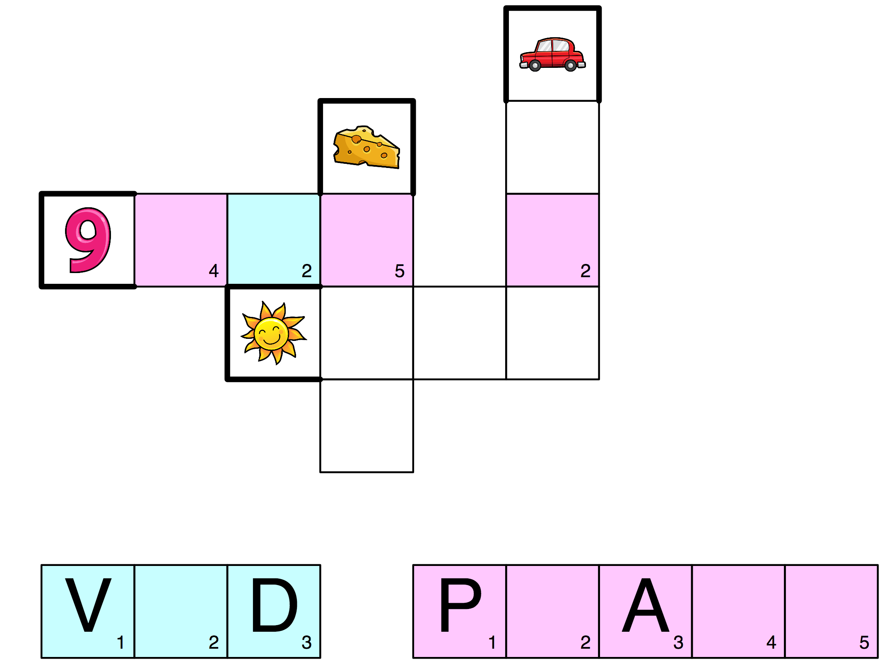

# The Puzzle Pirate story

Late 2017, my five-year old daughter had been quite ready to start learning to read for the past six months or so. She knew the alphabet well, knew the sounds the letters made when used in words, and understood that you combined the letters to make words. She has always loved books, and it was obvious that being able to read would be huge to her.

But she wouldn't practise. If she tried reading a word, there was always the chance that she might get it wrong, make a mistake. Not acceptible, of course, so she refused to try.

The only way I'd get her to try even once or twice was to bribe her with letter biscuits - I would spell out a word with a few letter biscuits and tell her she could eat the biscuits if she read the word they spelled. The performance requirement was not popular at all, but it would make her try a word or two.

## The breakfast incident

One morning, at breakfast, she pointed to a milk carton on the table and asked me "what is that?". On the carton was a crossword. I have always liked crosswords myself, so I started explaining to her how crosswords worked. She seemed interested and then it hit me: if I could get her to do crosswords it would be really good literacy training. She liked puzzles in general, so maybe it wasn't hopeless.

I did some Internet searching for "crosswords for kids" and found some simple ones that had image clues instead of text-based ones. I tried one on her and with some assistance she solved it. The crossword had five horizontal words, described by image clues, and one horizontal, "secret" word you got when you solved the whole crossword. This what it looked like:

<p align="center"><br><i>crossword puzzle for kids (in swedish)</i></p>

She seemed to like the fact that she learned a secret message through solving the crossword puzzle, so I thought "why not expand on that?" and created a similar crossword using Google docs presentation app (which is not bad for creating crosswords actually). My crossword spelled out my daughter's name as the secret message, and this really got her attention. She was like "A..M...A..L..I...A...Amalia??!" and then wondered how on earth the crossword could know her name.

<p align="center"><br><i>The Amalia crossword</i></p>

I decided to double down on my efforts after this. But what kind of secret messages would motivate her to continue solving the puzzles?  Then I had it: treasure hunt clues. She was crazy about treasure maps, would draw them all the time, and all kids love treasure hunts.

<p align="center"><br><i>Treasure hunt crossword</i></p>

These crosswords were much bigger than the previous ones, containing a lot more words. I tried to make them larger to ensure they would take a bit of time to solve because there was more work involved for me also, running around and hiding treasures in different places. The treasures would typically be a couple of cookies in a small plastic bag, or something like that.

## Treasure hunting overload

Maybe I helped her quite a bit with the first treasure hunt crossword, I can't really remember. What I do remember is that at first she would not finish a crossword in one sitting: it was too much work for her. So the first couple of crosswords would last about two days each. It took me 3-4 hours to create a crossword, so even doing a new one every other day would have been a lot of work.

As it turned out though, I quickly realized I wouldn't have a snowball's chance in a warm place to keep up. Her speed increased dramatically after the second or third treasure hunt crossword - she would now do them in one sitting, in less than 2 hours and with very little, if any, help. Then as soon as she'd found the treasure she would go "MORE crosswords daddy!!!". Every day when she came home from daycare she would ask me if I had a new crossword for her. I had this fantastic teaching opportunity but had dug myself into a hole - I had to automate the crossword production process somehow!

<p align="center"><br><i>One of the last treasure hunt crosswords made manually</i></p>

## Inventing the wheel

I started looking at software for crossword generation. There were some installable Windows programs, but to install a Windows program you first have to install Windows, and I wasn't yet that desperate. What I wanted was an online service. The online solutions seemed pretty crappy though: they generated very simple and rough-looking crosswords. I thought "I'll just create my own generator. How hard can it be?". Then I sat down and quickly hacked together a generator in [Go](http://golang.org)

It sucked. The crosswords it generated tended to be star shaped and not very dense, just like many of the online generators I had sneered at. So I spent a day or two actually thinking about how to make a decent algorithm for crossword generation, then I rewrote my generator and voila: now it actually produced pretty nice crosswords. Its output would be an ASCII box showing all the words and their placement, something like this:
```
##########   
# R      #
#SUN     #
# B A    #
# BANANA #
# L G    #
# ERROR  #
#   Y    #
##########
```

Now it just took me one hour to create a new treasure hunt crossword: I would generate something with the generator, make sure all the letters of my secret treasure hunt message were present in the crossword, then use Google docs to do the actual design and get a printable PDF.

## The commercialization phase

It was around here, at some point, that I thought "Why not make a much better online service for crossword generation?". Considering how crappy the existing ones were I thought that seemed like a good idea. So I decided to take the generator even further, and that meant some more work.

I started by extending the generator, adding functionality to output crosswords as PDF documents.

I then had to make sure the generator had decent word lists to work with. If you want to use image clues for all words, the words have to be carefully chosen so that a) the word is easy to spell for a beginner, b) it can be represented unambiguously with a simple illustration. For example, the word "TOAD" may look usable, but it is not because first association for many young kids, when they see a picture of a toad, will be "FROG". And many words are just impossible to illustrate using images. "BIG", for instance, is pretty hard. Remember that there mustn't be multiple associations possible for an illustration.

<p align="center"><br><i>Is it more froggy or toady?</i></p>

I spent a couple of days trawling through a huge list of over 70,000 swedish words. In the end I had about 300 words I thought were usable. I then found free-to-use illustrations for those words, and configured my generator to use those images.

## React-ions from friends

Great - now I had something that could create printable crosswords. I also had to have some kind of site where you could download them. When mentioning the project to a web developer friend, however, he said I ought to make the crosswords playable in a browser. He thought I should use [React](https://reactjs.org) to build a browser-based crossword app. 

So I did, and once again produced something pretty crappy. But it was React-based crap anyway.

My friend took pity on me when he saw the state of things and as he also happened to have a kid about the same age, who was also just about ready to learn to read, he decided to help out with the front-end parts. 

## Not a crossword generator anymore

We also pivoted a bit here, from aiming to produce a more generic "crossword generator" to instead try to create a crossword-based game for kids. More focus on kids, fun and games, and gamification. This strategical choice worried me somewhat, because when you aim to create a game for kids, you're entering a very large and very red ocean, in biz lingo. There are, literally, millions of games available for kids today.

But I still agreed and think it was the right choice because it meant we could focus on creating something we wanted to have ourselves, something we could put in the hands of our kids to help them learn to read.

## Build it for you

Not only is it more fun to build a product you want yourself, but the end result is also quite likely to have product-market-fit right out of the box. Some people think it is risky because you're not doing a proper market analysis and isn't it likely that you're the *only* one in the world who wants this and blablabla but that is just ignorance speaking. It is extremely *unlikely* that you're some kind of unique corner case and that there is noone else, anywhere with the same need as you. All things considered, I would guess that building a product you want and need yourself is commonly the most low-risk option of all.

The biggest issue, and one worth considering beforehand, is how easy it will be to *find* the rest of the market - the people who *also* want the same product. I had some ideas, but it was still a bit fuzzy to me exactly how we should behave to reach through the noise out there.

## Unique Spelling Points

Given our limited resources and obvious lack of talent we could never hope to create a game that was so much fun that the kids would relentlessly pressure their parents into buying the premium version. Or that was the assumption at least. 

So logically, our aim should be to create a crossword game that was fun enough to be endurable to kids playing it, and then we should market to parents how well it taught kids to read. The parents would then be motivated to buy the game, and perhaps also be involved when the kids played it. The parents could for instance create personalized treasure hunts, or other games, using the app.

Our USP (unique selling point) could be that most kids would become literate (here defined as: going from unable to read text, to be able to read text) simply by progressing through all the 12 game levels of the app. Very simple but powerful. I would definitely buy such an app.

## Does it work?

It has worked very well for my eldest daughter. The younger one, who is almost four years old, has been interested in it too. She started just two months ago or so and has only been doing a handful of crosswords as of yet, but she is already solving the lower-level crosswords without too much trouble. I think that if I stopped spending all my time programming and instead gave her some dedicated, secret-word treasure hunt crosswords like her sister got, she would be reading in no time too.

*That paragraph about me spending all my time programming was first meant to be a joke, but while writing it I realise I do need to spend more time with my younger daughter, and do the things for her that I did for her sister. The eldest kids always get so much more attention.*

## Treasure hunt interlude

I actually stopped writing after the last paragraph, because I felt an urgent need to create a treasure hunt puzzle for my younger daughter before my wife brought the kids home from day care. No time like the present.

I took two small metal containers with plastic lids and taped a picture of a treasure chest to the lids, so they would look more treasssury, like so:

<p align="center"><br><i>Treasure</i></p>

I found two small pieces of candy left from a birthday party that I put inside. Then I hid them and fired up Puzzle Pirate. I had to create two treasure hunts, of course, as the older girl would have been seriously upset if her sister was the only one to go on a treasure hunt. 

I generated a crossword at level 4 for my youngest daughter, with a secret message that translates to "BY THE PIANO". Here it is:

<p align="center"><br><i>Treasure hunt crossword</i></p>

And a level-12 crossword for the 5-year old with "LOOK IN THE TENT" as the secret message:

<p align="center"><br><i>Treasure hunt crossword</i></p>


