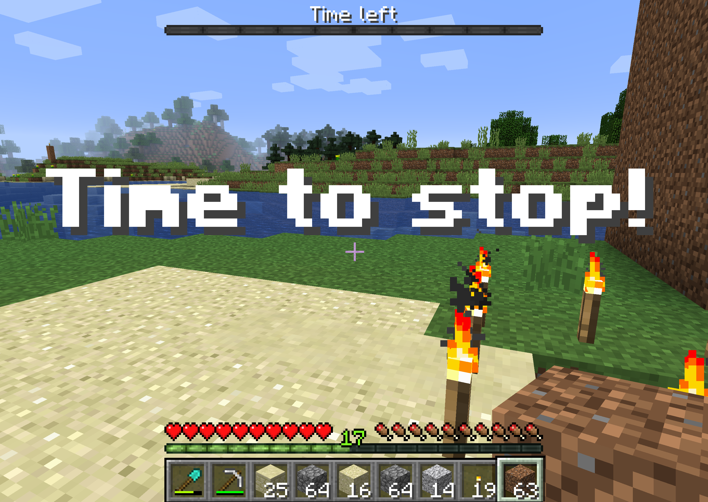

[<--Back to Odd Parity article index](https://github.com/ragnarlonn/oddparity)

 

# The Minecraft timer story

 
 

 <i>How to limit Minecraft playing time</i>

## Background

In the winter of 2017/2018, I gave my 5-and-a-half year old daughter her own first computer. 
It was an old Macbook Air that I bought in the states sometime in 2012. I installed some educational apps on it, 
and a single game. The idea was that she'd get used to real computers instead of just phones and tablets and also 
get encouraged to start writing on it (she loves to make her own books).

## Enter Minecraft

She used the computer moderately up until the summer of 2018, when she turned 6 years old. As a birthday present I 
installed Minecraft on it, and probably many parents can guess what followed; She got sucked in immediately and 
started playing for hours at a time. I had stupidly not expected it to be so popular with her, seeing as how she 
wasn't very proficient with either mouse or keyboard yet, and I suspected all the in-game menus etc. to be too 
complex for her. But she learned amazingly fast and after a few weeks she is building really cool things, uses 
the mouse and keyboard like a pro and has no problem getting around in the menus.

## Will she get square eyes?

All that is very nice of course, but neither me nor her mother thinks it is great that she spends several hours a day
staring at the computer screen. Kids need physical play too, and preferably outdoors (good for eyesight development, 
apart from the fresh air). So we've been scratching our heads about what to do. We don't want to have to micro manage
our daughter and keep tabs on exactly when she starts playing, or when she stops. We also don't want to limit
computer usage to certain days (like we have done with TV and tablets) because we think computer use is better
from a learning point of view.

## How to fix it

Luckily, I had set up two local [Minecraft servers](https://minecraft.net/en-us/download/server) on my work machine (an iMac). I did this so that me and my
daughter would be able to login to the same Minecraft world and collaborate. I decided to investigate how easy
it would be to control those servers remotely, and logout a player that had been playing too long. As it turns
out, it wasn't hard at all. 

Warning: if you're not interested in technical stuff, you may want to stop reading now!

I found out there is a protocol for remote access to the server console of a Minecraft server: [RCON](http://wiki.vg/Rcon).
Immediately I checked for any RCON implementations for Python and found the simple and straightforward
[MCRcon](https://github.com/barneygale/MCRcon) library. I installed that and it seemed to work, so then I just had to figure out what console
commands to send my Minecraft servers in order to list players on the server and to somehow
communicate the amount of time remaining to my daughter while she was playing, because just logging her
out without warning would __not__ have been popular.

The first issue was simple; Minecraft has a [/list](https://minecraft.gamepedia.com/Commands/list) command 
that lists all logged-in players on a server.

The second issue was slightly harder, but as it turned out, Minecraft has a [/bossbar](https://minecraft.gamepedia.com/Commands/bossbar) command that lets
you display a progress bar at the top of the screen. For fights against boss monsters I presume. This 
feature turned out to be an ideal way for me to display the amount of play time left. I set up a boss bar
with 10 segments (notches) to display in ten steps how much time was left. I also used [/playsound](https://minecraft.gamepedia.com/Commands/playsound) to 
play a sound (a cat noise) whenever I decremented the remaining time in the boss bar.

I debated what to do when all time was used up. I didn't want to just log her out of the server - she really
doesn't handle surprises like that very well. At first I tried playing random silly/annoying sounds
frequently, together with enabling random status effects on her player, but then I found the [/title](https://minecraft.gamepedia.com/Commands/title) command,
which was perfect. It lets you display a huge message right in the middle of the screen. So now I just
show a large "Time to stop!" message every 10 seconds when the time is up (plus occasionally, just for fun, 
playing some random sounds and using the "nausea" status effect to make her player dizzy). I think it
strikes a great balance - not too brutal and it allows her to finish up whatever she is doing but visible
enough (and slightly annoying) that she is not likely to continue playing or forget that she has passed
the time limit.

So, as this little app may be of use to someone else out there, I cleaned it up somewhat and put it here on Github. 

It is called [mctimer](https://github.com/ragnarlonn/mctimer)!

Oh, and by the way, I currently let my daughter play Minecraft 90 minutes per day. We'll see how it works but I 
think that might be a reasonable limit.
