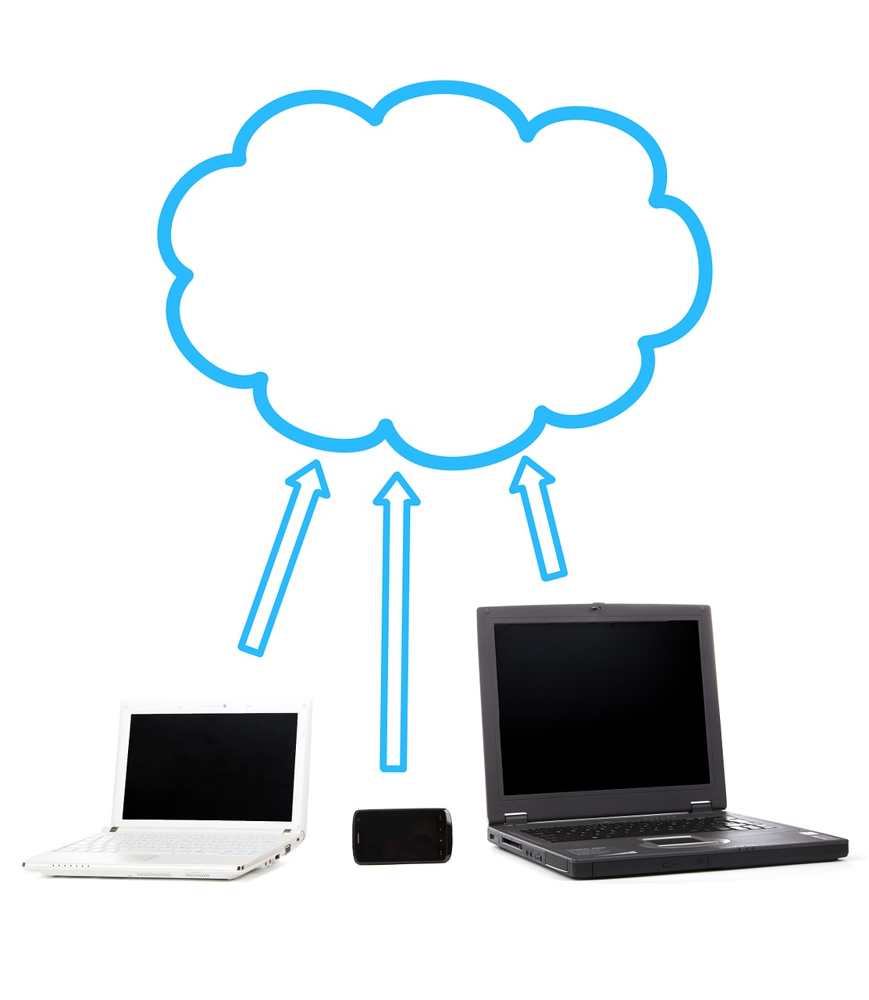

[<--Back to Odd Parity article index](https://github.com/ragnarlonn/oddparity)

 

# Save the pictures!

 
 

 <i><a href="https://github.com/ragnarlonn/savethepictures">savethepictures</a></i> backs it up

## Background

Like most people with a smartphone, I'm producing a lot of picture and video material continuously; especially pictures and 
videos of the kids in various situations, but lots of other things too. These are, of course, a digital legacy that I don't 
want to lose.

Unlike most people perhaps, I'm not happy with just sending all that data to some large, corporate giant somewhere and trust 
them to keep it safe for me. They could be hacked, they could be staffed with incompetent or uninterested staff that botch 
things and lose my data. Losing the data is the worst scenario, but another potential bad outcome is privacy violations as 
the corporation is forced by some authority somewhere to give up my data to them, and then who knows what will happen to it.

So - I want a solution that:

- allows me to store my data in multiple physical locations that I choose
- allows me to store data encrypted, when I don't trust the maintainers of the storage infrastructure
- allows me to store the data unencrypted (for convenience reasons), when I do trust the infrastructure maintainers
- uses encrypted channels to transfer data over the public internet
- will never overwrite or remove files already backed up (amazing how many solutions that do not support this)
- backs up data automatically, so I don't have to remember to do it. This means it should be possible to find
  client software for several different platforms (in my case, mostly Android and MacOS) that can perform the backups 
  automatically

There are lots of solutions out there, but none that I could find that offer all these things in one package. So after looking at tons of free and paid solutions, libraries and other things, I decided to create my own instead.

Eventually, I settled on a solution where I have my own little Raspberry PI-based file server at home. This is the central backup point to which all clients send their files to be backed up. The server runs sshd, so data can be sent to it using SFTP or SCP, which means file transers from clients are always encrypted and can happen over untrusted links (i.e. the public internet). Files on the server, however, are stored in unencrypted format, which means I can easily mount directories from the server on my local machines at home and e.g. look at pictures and videos.

The storage media is a USB memory stick that is mounted on `/backup` on the server. I can pull out and replace this 
memory stick once/year or so, putting the old stick in a safe deposit box, or similar. This makes it easy to keep an 
offline physical backup somewhere where an attacker can't reach it in case I am hacked by someone who wants to do some sabotage.

So that's all fine, but... While the replacable USB memory stick is a good thing for protection against the very black swan-ish case of someone hacking my online presence completely and sabotaging as much as they can, I also don't want a year's worth of data to disappear in case e.g. my house burns down. I need *automated* off-site backups. The simplest way to get this is to place the data with someone else - e.g. AWS. But then I want it to be encrypted so I don't give them or US authorities access to my data.

So I created this little shell script that performs that task for me. It is called sync-oneway-to-s3.sh and it runs once a day on the Raspberry PI server. This is what it does:

1. Make a complete list of all files in the `/backup` file tree (the mount point for the USB memory stick)
2. Make a complete list of all files in a remote AWS S3 folder that is the offsite backup location
3. Compare the lists, finding out what local files have no corresponding files in the S3 folder structure
4. Take all the missing files, encrypt them with [gpg](https://gnupg.org/), and then upload them to the S3 folder.

So any new files will be automatically encrypted and uploaded to AWS S3 storage once/day, which means I will only lose max a days' worth of data in case my house burns down.

On the client side, the bulk of the data (pictures and videos) are generated on mobile devices and it can be hard to find good client software to perform automated backups from mobile devices. Using a standard protocol like SCP/SFTP makes things easier though. Currently, we only have Android phones in my family and for Android I found the nice little app [FolderSync](https://play.google.com/store/apps/details?id=dk.tacit.android.foldersync.lite&hl=en) that supports SCP file transfers and has an option to never overwrite existing files.

If we look at computers - e.g. our stationary and laptop computers we work on daily - there is rarely any data on them that I need to backup together with family pictures and videos. If there are, I will manually put them in a separate folder and rsync them up to the `/backup` folder on the Raspberry PI, which means they will automatically be encrypted and sent to S3 for storage there.

Otherwise, I tend to more often rsync *from* the Raspberry *to* e.g. my iMac and Mac laptop, so I will have a local copy 
of all the files and can view pictures and videos whenever I want to - even when I'm offline. Rsyncing works equally well both ways of course, and by doing this I have extra full backups of the contents of the backup folder on the Raspberry.

All in all, this whole solution is very simple and pretty secure I would say. It does mostly everything I want it to, with standard software and very little work setting it all up.

If you want to set up something similar, feel free to steal my shell script and use as is or modify to suit you better. Here is the repo, with step-by-step setup instructions:

[https://github.com/ragnarlonn/savethepictures](https://github.com/ragnarlonn/savethepictures)

