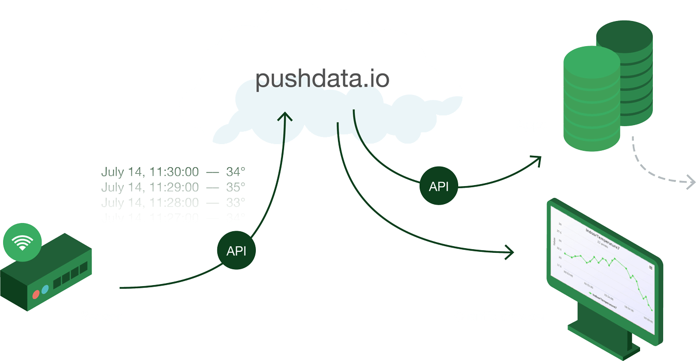

[<--Back to Odd Parity article index](https://github.com/ragnarlonn/oddparity)

 

# Pushdata.io - making it simple to store time series data

 
 

 <i><a href="https://pushdata.io">Pushdata</a></i>

## Background

A few years ago, I was the CEO of the online load testing service [loadimpact.com](https://loadimpact.com) and together with one of 
our angel investors I was trying to define and measure some [KPI](https://en.wikipedia.org/wiki/Performance_indicator) metrics 
for the business (this was actually one of the more fun parts of being a CEO, because I got to do a bit of Python coding).

When we knew what to measure, and I had written the code to do the measuring, a question came up: what do we do with the data? We 
were debating whether to set up a self-hosted database server where we could store the data, to use some managed db service out there, 
to store the data in the main db for our SaaS product or perhaps just dump to a text log file. It wasn't (at that point) a lot 
of metrics or a lot of data. We even discussed running the python scripts manually and then entering the results manually into a Google spreadsheet.

At one point, the angel investor made the comment "Why isn't there some really SIMPLE, managed service where you can just send a 
numeric measurement value, and have it stored for you?". I thought "Yeah, that's a really good question. Why isn't there?".

## Freeing up time to do it

The idea languished in my mind for a couple of years (yes, the round trip time can be long sometimes) while I was working with 
Load Impact. Recently, I quit my job at Load Impact in order to focus on personal projects. I wanted to take a stab at 
building products as a single developer. The first product (which I didn't build by myself actually - it was me and one other 
developer) was [Puzzle Pirate](https://puzzlepirate.net) - a crossword puzzle game for kids learning to read. 

After Puzzle Pirate I decided to take on this old data storage idea. To build a managed data storage service that was ridiculously 
simple. I decided to focus on [time series data](https://en.wikipedia.org/wiki/Time_series) because that is a very common type 
of data people collect and want to store. Smart sensors typically collect time series data. As do system monitoring solutions. 
[BI](https://en.wikipedia.org/wiki/Business_intelligence) systems do it. Etc. I realized that a very simple solution would perhaps not appeal to all businesses out there, as many 
of them collect a ton of data in various forms, and want to do advanced analysis on that data. These are better served by going 
to one of the multiple "big data analytics" companies and buy their services. But I thought there would also be a lot of 
people with lesser needs, for whom "big data analytics product X" would be complete overkill and the slow learning curve 
you get with an advanced product would be a too big barrier to entry.

A typical use case might be people working in IoT, who are building sensor networks and need somewhere to store their sensor 
readings. They might be hobbyists, with a very limited number of sensors and no wish to use an advanced "big data" solution, 
or they might be a company that just wants to get things up and running quickly, making sure their data is stored somewhere. 
They just don't want to have to worry about data being lost until they can figure out what to do with it. For many, I think simply storing the data in its original, time series format is the by far most important issue.

I looked around, but couldn't find any service that offered a super simple API to just dump your time series data points into, 
so I decided it was a valid idea for a SaaS business.

## Front-end angst

I have never been a good web developer. I stayed away from HTML/CSS/JS for 20 years, only using it when I absolutely had to. 
I could read it pretty well (except perhaps for CSS where I was really lacking in knowledge), but I couldn't really produce it. 
Instead, I got people to help me with front-end stuff, and generally tried hard to come up with solutions where front-end code 
wasn't necessary. Needless to say, it kind of limits the things you can do. The data storage project would need some web front-end 
parts, which was an issue, but help appeared suddenly when I went around discussing it with people.

I called the data storage project "Pushdata", as I found an available domain name in "pushdata.io", and when I mentioned it 
to some friends who run [Vinnovera](http://www.vinnovera.se/) - a web development consulting company - they said they might 
be able to assist with the front-end parts at no cost. They regularly took in students to do projects with them as part of 
their (the students') education. So I got professional project management help from Vinnovera, and front-end developer 
time from the students. I would just do the backend parts, which I'm of course always very happy to do.

 
<a href="https://pushdata.io/rich_eagle1@example.com">
  
 <i>Pushdata visualization example</i>

</a>
 

## Goal clashes

As it turned out, the students and my goals were not completely in alignment however; they were there to learn, and 
wanted to get hands-on experience with well-known frameworks and technologies. My main goal was simply to ship a product. 

We decided to use React and Redux to build the site, and the students got to work. Fast forward a couple of months and 
we have a decent-looking site up and running with the basic functionality there. Then the student project ended and I 
had to take over the front-end. How hard could it be?  Just learn a tiny little bit of React, which can't be so tricky as 
tons of people seem to be using it, and then do the final, tiny bit of polishing needed before release.

## Diving into murky waters

As it turned out, learning React+Redux wasn't an immediate "Aha" experience. At least not for me. Part of it is 
probably that I lack a lot of basic web developer experience and -knowledge, but part of it is likely also that 
React is simply a pretty big piece of software, that can do a lot of things. I spent a couple of days reading 
React and Redux tutorials, looking at some videos etc. but didn't feel like I was on top of things after that.

I realized my lack of basic HTML/CSS/JS knowledge (particularly CSS was a bit of a black hole) needed fixing first, 
and that diving into React and Redux at the same time may have been unwise. I knew the functionality I wanted to build 
was quite limited - why not try to build it in vanilla HTML/CSS/JS?  That way I could be productive right away, and 
would learn a lot of basics along the way. I decided to make an experiment: spend a couple of days trying to replicate 
the existing React app in vanilla HTML/CSS/JS, and if I made good progress I'd continue on that path. If not, I 
would have to bite the bullet and learn React properly.

As it turned out, I needed only two days to make the page render the same as it did in the React version. That 
encouraged me to spend another week on building the logic in Javascript, and when I made good progress there too 
I put in a second week and had basically the same app, but without React and Redux. The codebase shrunk from 100 
source files and 4,500 lines of code, to 3 source files and 1,000 lines of code. What was even better was that the page 
weight went from ~6MB for the compiled React app, to ~400kB for my vanilla HTML/CSS/JS, which meant much faster load 
and render times on slow connections.

And I knew the code base inside and out. That's a big plus.

I felt my productivity on the front-end side increase a lot after these two weeks, but then came the next 
disappointment, which should not have been a surprise really: the realization that the devil really is in the 
details.

 

 <i>Throwing in a picture to make this article less text-heavy</i>

 

## The devilish details

So, a SaaS that claims to free you from having to worry about storage of your precious data should probably not 
have a UI that looks half-finished. It does not inspire confidence that the backend system you cannot see isn't also 
only half done. I decided that the UI had to look at least somewhat professional. This meant that a little bit 
of obsession with detail was warranted.

As my strength is more on the backend side of things, this took a lot of time. Not using any kind of UI framework 
may also have contributed to the time it took, but I actually don't think it was a biggie because the app is 
*very* small - there are only two real views/pages and many/most UI elements are only used in one place in the app.

And then there were all the other details you tend to not think about at first. Like subscriptions. I had only worked with one-off payments in other projects, so was new to Stripe subscriptions and I can tell you that accepting a single payment with Stripe is dead simple compared to dealing with subscriptions. Next time I'll probably use a Subscription solution provider that runs on top of Stripe, like [Chargebee](https://www.chargebee.com) or [Recurly](https://recurly.com).

Documentation is another big one. It took me a while to find the right solution for the Pushdata REST API documentation. The API docs have to be very good for a product that basically *is* its API. When I finally found a good solution - [speca.io](https://speca.io) - it still took a while to actually create the 
docs. Speca.io is very nice though, and offer a free tier which is important to me when I am just testing whether this 
product will fly or not. I don't want to sign up for fixed costs until I have revenue coming in.

Oh yeah, I almost forgot to mention that I got some unexpected backend work also. I threw out [InfluxDB](https://www.influxdata.com) that I originally used to store the time series data, and replaced it with [TimescaleDB](https://www.timescale.com). I did this for two reasons: the biggest was that I wasn't happy with InfluxDB. I don't 
like its client libraries, which feel not so easy or intuitive to use (at least not the Golang one) and where the documentatiuon isn't great, and I also didn't feel confident about the functional stability of InfluxDB. I had some weird 
things happen, which may have been completely due to my lack of knowledge about how to use the database, but in the 
end I felt insecure trusting InfluxDB with my (my users') data. I had the same feeling about [Cassandra](http://cassandra.apache.org/) in another project, but there I was more certain that it was mainly a case of me not knowing how to run Cassandra (and big Java apps in general).

TimescaleDB, on the other hand, has a couple of really big advantages when I'm the user: It is actually an extension/plugin for PostgreSQL, which means that configuring and operating it is more or less identical to configuring and operating any PostgreSQL database. I have been using PostgreSQL a lot for about a decade now, so everything about TimescaleDB is very familiar to me. It also means that I only need *one* single database software. I just need a PostgreSQL server with the TimescaleDB extension installed on it, and then I can use it both to store my main user data *and* the time series data. Being able to lose one big, complex piece of server software dependency is a huge bonus.

The biggest penalty I get from switching is that I lose InfluxDB's native support for tagging data. I am not 100% sure, but 
I think InfluxDB does its tagging quite efficiently, and I may not be able to get the same performance with name-value tagged data points when using TimescaleDB, and tagging data is something I feel I might want to implement sometime after release.

Another thing that took time was implementing responsiveness into the UI. I.e. the ability to adapt to small and large screens, and to work on very small screens like mobile devices. I initially thought not to support users on mobile devices, 
as their small screens are definitely not great for displaying time series data as graphs, but when thinking more about 
it I realized that many people today are probably using a mobile device when they take a first look at some new product 
or service, and the experience they get then is going to determine whether they go on to sign up as a user, or not. It 
is getting more and more important to offer a good "information gathering experience" to potential new users that 
are on a mobile device, even if they cannot use the product on the mobile device. In the end I spent the effort so 
the product *can* be used on a mobile device, though I definitely recommend being on a computer if possible.

On top of these major things that had to be done, there are of course a million small things, mainly related to user experience. That text should be just a tiny bit lighter in color. That element is off-center, it needs to move up 2 pixels. 
That modal layout isn't the exact same as for the other modals - they should be consistent. That error message isn't very informative, give it a call to action. Etc, etc. And there are at least a million things still to fix, it feels like. But this is a test, like any new product, and the amount of work that goes into it before it has proven itself has to have an upper bound.

*If you're not ashamed when you release your product you're releasing too late*

So [here](https://pushdata.io) it is. Please try it out and tell me what you think. And please spread the word if you know anyone you think may find it useful. I currently have no marketing budget, this is it, so I need all the help I can get!

 

 <i><a href="https://pushdata.io">Pushdata</a></i>

